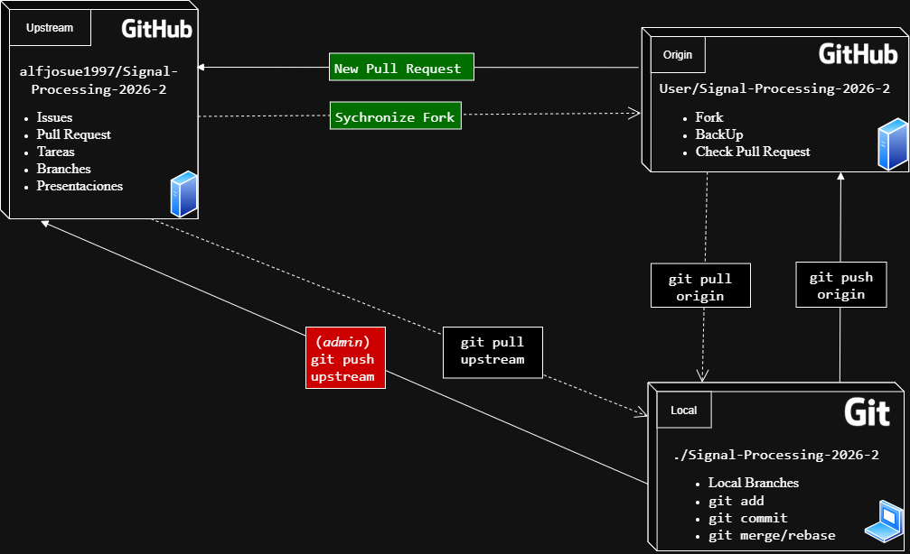
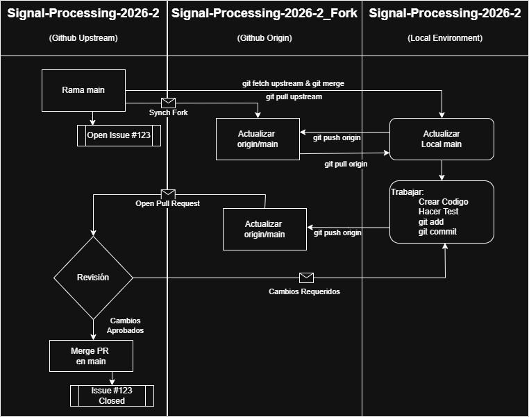

# Reglas para contribuir



El espacio de trabajo puede dividirse en tres áreas:

1. **Upstream**: es el repositorio de la clase, solo los profesores tienen acceso directo a colaborar y modificar los elementos del repositorio. Los estudiantes pueden colaborar mediante *Pull Requests*.
2. **Origin**: es el **Fork** del proyecto. Desde este repositorio se harán los *Pull Request*. Sirve como respaldo del trabajo realizado en **Local** para poder trabajar en otras computadoras.
3. **Local**: es el clon del proyecto en la computadora local. Este se gestiona con Git y es donde se editan los archivos, se resuelven conflictos y se crean las ramas *develop* para no interferir en el trabajo de los demas.

Primero debes hacer **Fork** al repositorio de la clase para tener una copia en tu cuenta de **Github**. Luego debes clonar el repositorio en tu computadora local. Esto creara el repositorio local enlazado a tu **Fork** (Remote: *origin*). 

```bash
git clone https://github.com/tu-usuario/Signal-Processing-2026-2.git
```

Para configurar el repositorio remoto (Remote : *upstream*) en la terminal, dentro del directorio del proyecto:


```bash
git remote add upstream https://github.com/alfjosue1997/Signal-Processing-2026-2.git
```

Esto añade al archivo oculto `.git` el repositorio principal de la clase.

# Flujo de Trabajo (Workflow)

Primero revisa que tengas todos los repositorios configurados en tu directorio local:

```bash
git remote -v
```

Tu **Fork** debe llamarse *origin* y el repositorio de la clase debe llamarse **upstream**.

Este proyecto utiliza un esquema de **Fork & Pull**. Todos los colaboradores trabajan en sus propias copias y proponen cambios al repositorio central mediante Pull Requests.



1. **Sincronizar**: Antes de empezar, actualiza tu rama `main` local con el repositorio principal. 
   1. Primero regresamos a la rama main:

      ```bash
      git checkout main 
      ```

      Luego actualizamos los cambios:
      
      ```bash
      git pull upstream main
      ```

      Por ultimo, actualizamos el **Fork**: 

      ```bash
      git push origin main
      ```

   2. Existe la opción de primero sincronizar el **Fork** en Github usando `Synch Fork` en Github y luego sincronizar con tu repositorio:

      ```bash
      git checkout main 
      git pull origin main
      ```

2. **Desarrollar y Publicar**: Despues de que termines de trabajar, has `git add` y `git commit` y sube tu trabajo a tu repositorio en Github
   ```bash
   git push origin main
   ```
   Luego, abre un **Pull Request** en GitHub desde tu **Fork** hacia el repositorio original: `alfjosue1997/Signal-Processing-2026-2`.

3. Si los profesores aceptan tus cambios se aceptará y cerrará tu *Pull Request* y tus cambios de unirán a la rama main (`git merge`). Sí se requiere que hagas cambios a tu codigo se te pedira mendiante un mensaje en Github

